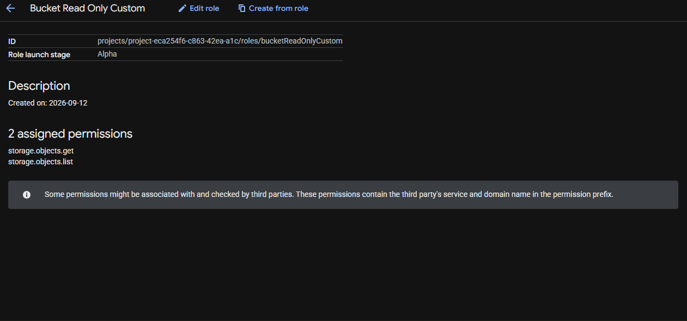
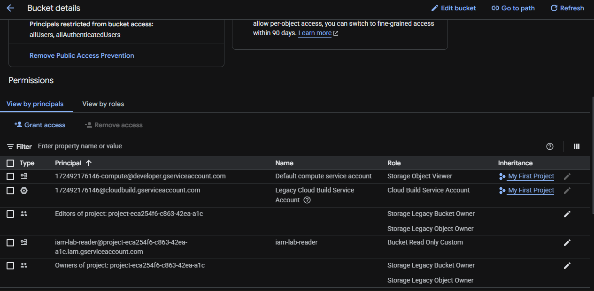
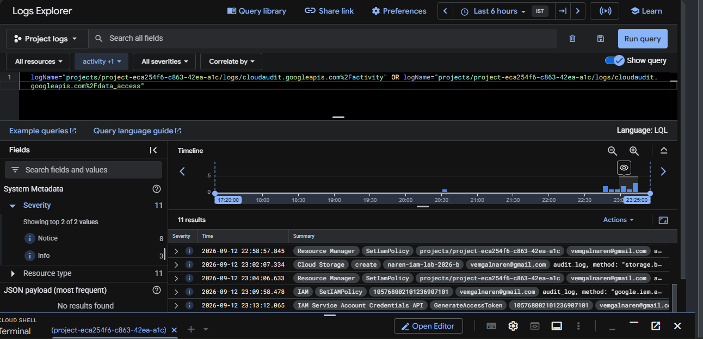

# GCP IAM Least-Privilege Lab

A hands-on project demonstrating core Google Cloud IAM concepts: custom roles, dedicated service accounts, policy inheritance, and audit logging — built and verified end-to-end on a real GCP project.

## What This Project Demonstrates

- Creating a **custom IAM role** with a minimal, hand-picked permission set (no more than needed)
- Using a **dedicated service account** instead of a project's default service account (which is often over-privileged by default)
- Binding a role at the **resource level** (a single bucket) instead of the project level, following the principle of least privilege
- Observing **IAM policy inheritance** firsthand — granting a broader role at the project level and watching it cascade down to every resource beneath it
- **Reverting** an over-broad grant and confirming the cascade stops
- **Verifying least privilege is enforced**, not just configured, by attempting an allowed action (list) and a disallowed action (delete) using the scoped identity
- Reading the resulting activity in **Cloud Audit Logs** to confirm every IAM-governed action is recorded with principal, method, and timestamp

## Steps

1. **Created a test bucket** (`naren-iam-lab-2026`) with one file (`test.txt`) to protect.
2. **Created a custom role** (`Bucket Read Only Custom`) with exactly two permissions:
   - `storage.objects.get`
   - `storage.objects.list`
3. **Created a dedicated service account** (`iam-lab-reader`) with no roles granted at creation time — avoiding the common mistake of relying on an over-privileged default service account.
4. **Bound the custom role to the service account on the single bucket only**, via the bucket's Permissions tab.
5. **Deliberately granted a broader role** (`Storage Object Admin`) to the same service account at the **project** level, then confirmed via a second bucket that the access cascaded to resources it was never explicitly granted on. Reverted the grant and confirmed the cascade stopped.
6. **Verified enforcement** using `gsutil` with `--impersonate-service-account`:
   - `ls` succeeded (permitted by the custom role)
   - `rm` failed with `403 AccessDeniedException: storage.objects.delete denied` (correctly blocked, since delete was never granted)
7. **Confirmed the audit trail** in Cloud Logging's Logs Explorer, querying `cloudaudit.googleapis.com%2Factivity` and `%2Fdata_access` — every action (service account creation, IAM policy changes, impersonated token generation) appeared with the acting principal, method name, and timestamp.

## Key Commands Used

```bash
# List a file as the scoped service account (should succeed)
gsutil -i iam-lab-reader@<PROJECT_ID>.iam.gserviceaccount.com ls gs://naren-iam-lab-2026

# Attempt to delete the file as the scoped service account (should be denied)
gsutil -i iam-lab-reader@<PROJECT_ID>.iam.gserviceaccount.com rm gs://naren-iam-lab-2026/test.txt

# Grant yourself impersonation rights on the service account, if needed
gcloud iam service-accounts add-iam-policy-binding \
  iam-lab-reader@<PROJECT_ID>.iam.gserviceaccount.com \
  --member="user:<your-email>" \
  --role="roles/iam.serviceAccountTokenCreator"
```

## Screenshots

| Custom Role Permissions | Bucket-Scoped Access | Audit Log Trail |
|---|---|---|
|  |  |  |

## What This Proves

Least-privilege access in GCP isn't just a checkbox — it's enforced at the API level, it's observable through inheritance behavior across the resource hierarchy, and every governed action leaves a verifiable trail in Cloud Audit Logs.

## Next in This Series

- Chapter 2: Compute Engine — attaching this same least-privilege service account to a running VM
